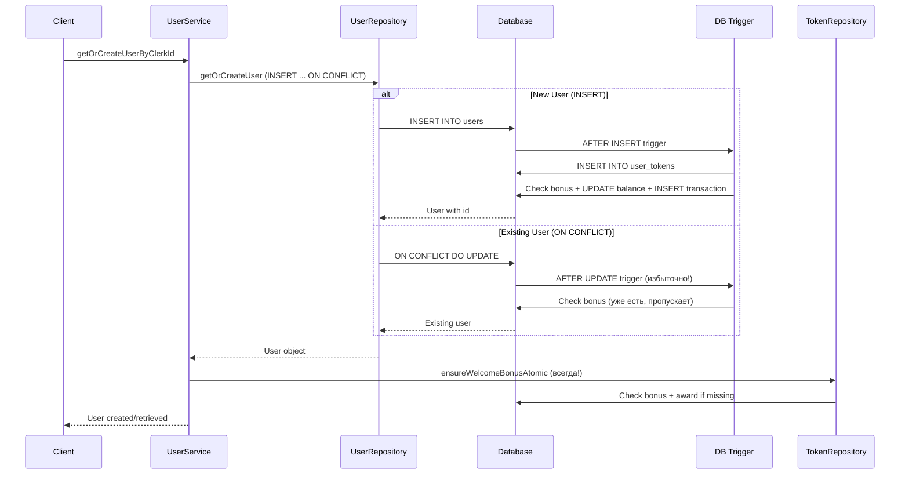

# Финальное ревью кода: Пользователи и токены

## ✅ Что работает правильно

### 1. Аутентификация
- ✅ Валидация device ID корректна
- ✅ Проверка Clerk токенов работает
- ✅ Обработка ошибок правильная

### 2. Атомарное создание пользователей
- ✅ `INSERT ... ON CONFLICT` предотвращает race conditions
- ✅ Fallback на поиск существующего пользователя при ошибках

### 3. Database Trigger
- ✅ Автоматически создает токены при INSERT
- ✅ Проверяет наличие бонуса перед выдачей
- ✅ Работает для новых пользователей

## ⚠️ Обнаруженные проблемы

### 1. КРИТИЧНО: Триггер срабатывает на UPDATE

**Проблема**: Триггер настроен на `AFTER INSERT OR UPDATE`, что означает:
- При каждом `ON CONFLICT DO UPDATE` триггер проверяет и выдает бонус
- Это избыточная нагрузка на БД
- Хотя проверка `IF NOT EXISTS` защищает от двойной выдачи, это лишняя работа

**Текущий код**:
```365:367:api/repositories/database.ts
        CREATE TRIGGER trigger_initialize_new_user
          AFTER INSERT OR UPDATE ON users
          FOR EACH ROW
```

**Рекомендация**: Триггер должен срабатывать только на INSERT для новых пользователей. Для существующих пользователей (ON CONFLICT) бонус должен выдаваться через `ensureWelcomeBonusAtomic`.

### 2. Избыточная проверка бонуса

**Проблема**: После создания/получения пользователя всегда вызывается `ensureWelcomeBonus`, даже для новых пользователей, где триггер уже выдал бонус.

**Текущий код**:
```23:26:api/services/user.service.ts
    // Tokens and welcome bonus are automatically created by database trigger
    // For backward compatibility, ensure welcome bonus is given if missing
    // Check is done inside ensureWelcomeBonus by checking transaction existence
    await ensureWelcomeBonus(user.id, 'clerk');
```

**Последствия**:
- Лишний запрос к БД для новых пользователей
- Двойная проверка (триггер + ensureWelcomeBonus)
- Хотя безопасно (проверка на существование транзакции), но неэффективно

**Рекомендация**: Вызывать `ensureWelcomeBonus` только если пользователь был получен через `ON CONFLICT` (существующий), а не создан заново.

### 3. Потенциальная race condition в триггере

**Проблема**: В триггере проверка и выдача бонуса не атомарны:
```338:352:api/repositories/database.ts
          IF NOT EXISTS (
            SELECT 1 FROM token_transactions
            WHERE user_id = NEW.id
              AND type = 'bonus'
              AND description = bonus_description
          ) THEN
            -- Update balance atomically
            UPDATE user_tokens
            SET balance = balance + bonus_amount, updated_at = NOW()
            WHERE user_id = NEW.id;

            -- Add transaction record
            INSERT INTO token_transactions (user_id, amount, type, description)
            VALUES (NEW.id, bonus_amount, 'bonus', bonus_description);
          END IF;
```

**Последствия**: При одновременных INSERT двух пользователей с одним clerk_id/device_id (что невозможно из-за UNIQUE), но при UPDATE может быть race condition.

**Рекомендация**: Использовать атомарную операцию в триггере (аналогично `ensureWelcomeBonusAtomic`).

### 4. Неоптимальная логика в ensureWelcomeBonusAtomic

**Проблема**: Функция сначала вызывает `getOrCreateTokenBalance`, а потом атомарный запрос:
```259:260:api/repositories/token.repository.ts
  // First, ensure tokens record exists
  await getOrCreateTokenBalance(userId);
```

**Последствия**: Две отдельные операции вместо одной атомарной.

**Рекомендация**: Включить создание токенов в атомарный CTE запрос.

## 🔧 Рекомендации по исправлению

### Приоритет 1 (Критично)

1. **Изменить триггер на INSERT только**:
   ```sql
   CREATE TRIGGER trigger_initialize_new_user
     AFTER INSERT ON users  -- Убрать OR UPDATE
     FOR EACH ROW
     EXECUTE FUNCTION initialize_new_user();
   ```

2. **Вызывать ensureWelcomeBonus только для существующих пользователей**:
   - Определять, был ли пользователь создан или получен через ON CONFLICT
   - Вызывать `ensureWelcomeBonus` только если пользователь существовал

### Приоритет 2 (Важно)

3. **Сделать триггер атомарным**:
   - Использовать один запрос с CTE для проверки и выдачи бонуса

4. **Оптимизировать ensureWelcomeBonusAtomic**:
   - Включить создание токенов в атомарный CTE запрос

## ✅ Итоговый вердикт

**Будет ли работать?**
- ✅ **Аутентификация** - работает правильно
- ✅ **Создание новых пользователей** - работает правильно (триггер создает токены и бонус)
- ⚠️ **Существующие пользователи** - работает, но избыточно (триггер + ensureWelcomeBonus)
- ⚠️ **Производительность** - есть избыточные запросы
- ⚠️ **Race conditions** - минимальный риск в триггере

**Рекомендация**: Код будет работать, но есть избыточность. Для production рекомендуется:
1. Изменить триггер на INSERT только
2. Оптимизировать вызов ensureWelcomeBonus
3. Сделать триггер полностью атомарным

## 📊 Диаграмма текущего потока



**Проблемы в диаграмме**:
- Триггер срабатывает на UPDATE (избыточно)
- ensureWelcomeBonus вызывается всегда (избыточно для новых пользователей)

